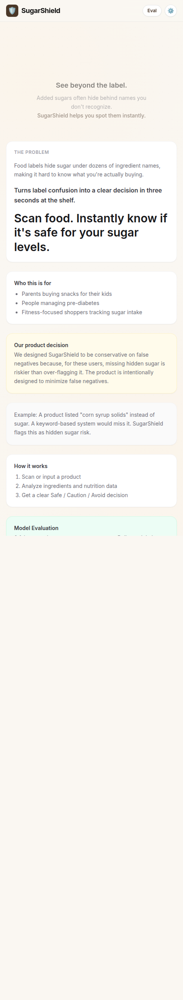
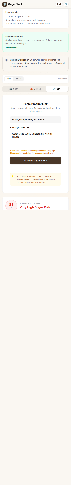
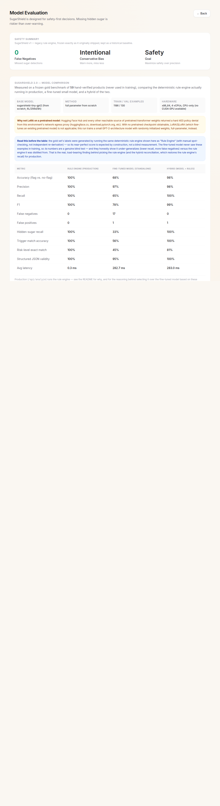

# SugarShield

**Live:** [https://sugarshield.vercel.app/](https://sugarshield.vercel.app/) · **Eval Dashboard:** [https://sugarshield.vercel.app/eval](https://sugarshield.vercel.app/eval)

**Know what sugar is hiding in your food while you shop.**

SugarShield is a browser-native hidden-sugar intelligence system: it combines a deterministic ingredient-detection engine (its production system) with a fine-tuned Qwen2.5-1.5B model (its research/offline track) behind one shared `POST /api/analyze` contract, delivered primarily through a Chrome extension that scans product pages as you shop — with a secondary web app for manual analysis, benchmark transparency, and everything documented below.

SugarShield started as a keyword-matching MVP with a 15-case eval set. **SugarShield 2.0** rebuilt that into a real ingredient-intelligence system: a 145-alias categorized sugar lexicon, a 1,375-record labeled dataset, a fine-tuned model actually trained and benchmarked, a **second, independently-labeled benchmark built specifically to check the first one wasn't circular**, a hallucination guard, and a Chrome extension repositioned as the primary product surface.

---

## The evolution

```
SUGARSHIELD V1                              SUGARSHIELD V2
─────────────────                           ─────────────────
30-term keyword list                        145-alias categorized lexicon, canonical mapping
No risk taxonomy (PASS/WARN/FAIL only)  →   SAFE/LOW/MODERATE/HIGH/VERY_HIGH + score
15-case eval set                            1,375-record dataset + a separate, non-circular
                                             132-record independent benchmark
No dedicated model                          A from-scratch model (committed, benchmarked) +
                                             a real Qwen2.5-1.5B LoRA fine-tune (research track)
Simulated "lenient mode" numbers            Real strict/lenient scoring, two real benchmarks
No hallucination protection                 Hallucination guard rejects unsupported model claims
Web app only                                Chrome extension (primary) + web app (secondary),
                                             one shared API
```

### Architecture

```
                         ┌─────────────────────────┐
                         │   POST /api/analyze      │   ← single canonical contract
                         └────────────┬─────────────┘
                                      │
        ┌─────────────────────────────┼─────────────────────────────┐
        │                             │                             │
   Normalize text            Deterministic detection          (research track,
  (lib/normalizeIngredients)  (lib/lexicon + riskEngine)        not called at
        │                             │                         request time —
        └──────────────┬──────────────┘                         see below)
                        │                                             │
                Reconciliation (rules are authoritative;      ml/checkpoints/
                a model can only ADD signal, never drop        sugarshield-v1
                a known sugar term)                                   │
                        │                                    ml/evaluate.py
                 SugarShield result                          benchmarks all
                        │                                    three systems
        ┌───────────────┴───────────────┐
        ▼                               ▼
    Web app (Next.js)              Chrome extension (MV3)
    /  /eval  /metrics             popup + Amazon/Walmart/Target adapters
```

Both the web app and the Chrome extension call the exact same `POST /api/analyze`. Production runs the deterministic engine (`lib/riskEngine.ts`) — see [Production model/system selected](#production-modelsystem-selected-the-deterministic-rule-engine) for why, based on the actual benchmark results below, not a shortcut.

---

## The sugar knowledge layer (`lib/lexicon.ts`)

**145 aliases, 77 canonical terms, 8 subcategories** — categorized, not a flat keyword list, and every alias maps to one canonical display name so synonyms collapse into a single detection instead of counting as separate hits (e.g. `hfcs` / `high-fructose corn syrup` / `high fructose corn syrup` → one entry: `high fructose corn syrup`).

| Category | Subcategories | Examples | Effect |
|---|---|---|---|
| Added sugar | Added Sugars, Syrups, Glucose/Fructose Derivatives, Malt-Derived, Fruit Concentrates | sugar, jaggery, panela, cane syrup, high fructose corn syrup, levulose, malt extract, barley malt syrup, grape/apple juice concentrate | `contains_added_sugar = true` |
| Hidden sugar | (spans the categories above) | maltodextrin, dextrin, corn syrup solids, brown rice syrup, evaporated cane juice, tapioca syrup | also `contains_hidden_sugar = true` |
| Artificial / non-nutritive sweetener | Artificial/Non-Nutritive | aspartame, sucralose, acesulfame potassium, sodium cyclamate, stevia, monk fruit, allulose | `contains_artificial_sweetener = true` |
| Sugar alcohol / polyol | Sugar Alcohols | erythritol, xylitol, sorbitol, maltitol, tagatose, hydrogenated starch hydrolysate | grouped with sweeteners, weighted lower |
| Natural sugar context | Natural-Sugar Context | milk, lactose, coconut water, whole fruit | `contains_natural_sugar = true` — **never** raises risk by itself |

Detection (`canonical`/`term`/`category`/`subcategory` on every match) and risk *judgment* are deliberately separate steps (`detectMatches` → `scoreRisk` → `riskLevelFromScore`), so finding "milk" doesn't imply HIGH risk, and finding two real added-sugar sources does — regardless of marketing copy on the box. Both `lib/lexicon.ts` (TypeScript, production) and `data/scripts/lexicon.py` (Python, dataset/eval pipeline) are kept as exact mirrors of each other.

**Strict vs. Lenient**, both real (not simulated): Strict weighs artificial sweeteners and sugar alcohols heavily (safety-first, high recall). Lenient keeps every detection but weighs debated ingredients (stevia, monk fruit, erythritol, diet soda) much less, so it warns less where the nutritional science is unsettled. Toggle it on the home page or pass `"mode"` to `/api/analyze`.

One calibration fix made mid-build: `"caramel color"` was originally in the added-sugar list and was flagging every diet soda as "contains added sugar" purely from its trace coloring agent — removed, with the reasoning left as a comment in `lib/lexicon.ts`. This is exactly the over-warning failure mode the project set out to reduce.

---

## Dataset

**1,375 total records** — **1,188 train / 128 validation / 59 gold** (frozen, never trained on, zero id/content overlap — verified by `data/scripts/detect_leakage.py`).

**Source:** [GroceryDB](https://github.com/Barabasi-Lab/GroceryDB) (MIT license, Barabási Lab/Northeastern University; published alongside their *Nature Food*/*Nature Communications* papers) — **50,638 real products** scraped from Target, Walmart, and Whole Foods. Real ingredient lists are reconstructed from GroceryDB's per-product `ingredient_tree` JSON, preserving label order and sub-ingredient parentheticals.

*The original plan was Open Food Facts' REST API. It — and Hugging Face Hub, Wikipedia, and Kaggle — returned a hard 403 policy denial from this build environment's network egress proxy. GroceryDB, reachable via a plain `git clone`, was the substitute. Full reasoning in `data/README.md`.*

- **1,355 / 1,375 records (99.6%) are real products.** Train and validation are 100% real. Gold is 54/59 (91.5%) real + 5 hand-composed records for concepts (isolated dextrose, isolated maltodextrin, etc.) that needed a clean, unambiguous example.
- Bulk labels are **silver-labeled**: generated by running a faithful Python port of the *same* `lib/lexicon.ts` + `lib/riskEngine.ts` used in production (`data/scripts/lexicon.py`, `risk_engine.py`) — i.e. distillation, not independent human annotation. `"verified": false` on every bulk record says so explicitly. Only the 59 gold records are `"verified": true`.
- Categories: 17 buckets spanning soda, juice, cereal, protein bars, yogurt, sauces, snacks, desserts, bread, breakfast, kids' food, "healthy"-marketed products, sugar-free, artificially-sweetened, and natural-sugar products.
- Risk levels: HIGH 514 · VERY_HIGH 314 · MODERATE 286 · SAFE 234 · LOW 27 (full breakdown in `data/processed/dataset_stats.json`).
- The gold set specifically includes the hard calibration cases: a diet soda with only aspartame, a diet soda with three stacked sweeteners, isolated stevia, isolated monk fruit, real HFCS and fruit-juice-concentrate products, a product with 4 stacked sugar aliases, and three "misleading healthy" products that still contain 2+ real added-sugar sources.

Full methodology, exact re-run commands, and licensing: [`data/README.md`](data/README.md).

### The independent benchmark (`data/independent_gold/`)

The 59-record gold set above has an honest limitation, stated plainly rather than glossed over: most of its labels were **silver-labeled** — generated by running `lib/riskEngine.ts`/`lib/lexicon.ts` itself (via their Python port), not derived independently. A system scoring itself against labels it produced will score near-perfectly *by construction*; that's not proof of real-world accuracy.

**`data/independent_gold/independent_gold.jsonl` is a separate, frozen, 132-record benchmark built to answer that question honestly.** Every label (`expected_risk`, `hidden_sugar_terms`, `artificial_or_nonnutritive_sweeteners`, `contains_added_sugar`, `natural_sugar_context`) was produced by directly reading each product's raw ingredient text and reasoning about it — the way a human food-label reviewer would — using general public nutrition/food-science knowledge, **never by calling `risk_engine.py` or `analyze_ingredients_text()`**. `data/independent_gold/check_no_overlap.py` verifies zero id/GroceryDB-source/product-name overlap with train, validation, and the original gold set. Full methodology: [`data/independent_gold/README.md`](data/independent_gold/README.md).

Running the rule engine against this independent set (see [Benchmark](#benchmark-rule-engine-vs-fine-tuned-model-vs-hybrid) below) shows exactly what the circularity concern predicts: accuracy drops from a self-graded 100% to an honest **90.9%**. That's the real number — reported here instead of the inflated one.

---

## Fine-tuning

**A real training run was executed — not just scripted.** But not the originally planned one, for a documented environment reason:

### Why the plan changed: no LoRA on a pretrained checkpoint

The plan was LoRA/QLoRA fine-tuning a small pretrained instruction model (0.5–3B params, e.g. Qwen2.5-0.5B-Instruct) pulled from Hugging Face Hub. **`huggingface.co` (and `download.pytorch.org`, and effectively every host outside a curated allowlist of PyPI/npm/crates.io/GitHub) returns a hard 403 policy denial from this build environment.** This was verified directly with `curl`, Python `requests`, and a web-search tool before switching approaches — it's a policy decision, not a flaky network, so it wasn't retried or routed around.

With no pretrained checkpoint or vocab reachable, `ml/train.py` instead:
- trains a **byte-level BPE tokenizer from scratch** on SugarShield's own prompt+JSON corpus (`ml/prepare_dataset.py`, using `tokenizers`), and
- trains a **small GPT-2-architecture model from scratch, full-parameter** (`transformers.GPT2LMHeadModel`, randomly initialized) — LoRA doesn't apply with no pretrained weights to adapt.

`train.py` still has a real `--use_lora --base_model <hub-id>` code path for anyone running this pipeline where Hugging Face Hub **is** reachable. The run actually executed and checked into this repo took the from-scratch path.

### The actual run

| | |
|---|---|
| Architecture | GPT-2 style causal LM, 6 layers / 256 dim / 8 heads |
| Parameters | **5,871,616** (from scratch, full-parameter — not LoRA) |
| Tokenizer | Custom byte-level BPE, 8,000 vocab, trained on this dataset |
| Training examples | 1,188 (+ 128 held out for validation, + 59 gold never seen) |
| Epochs / batch | 6 epochs, batch 8, grad-accum 2 (effective batch 16) |
| Hardware | 4 vCPU, 15GB RAM, **CPU only — no GPU available** |
| Duration | 607 seconds (~10 minutes) |
| Final train loss | 0.648 |
| Eval loss | 0.125 |

Exact config: [`ml/configs/training_config.json`](ml/configs/training_config.json). Exact measured run output (not hand-typed): [`ml/results/training_run.json`](ml/results/training_run.json). Checkpoint: [`ml/checkpoints/sugarshield-v1/`](ml/checkpoints/sugarshield-v1/) (23MB, committed to this repo).

The checkpoint was verified after training — loaded via `ml/infer.py`, not the untouched random-init model — and produces syntactically valid structured JSON on a held-out product.

### The Qwen2.5-1.5B track (LoRA on real pretrained weights)

This build environment's network egress blocks `huggingface.co` outright (see above), so the from-scratch model is what's actually committed and benchmarked in this repo. But `ml/train.py --use_lora --base_model Qwen/Qwen2.5-1.5B-Instruct` is a real, fully-implemented LoRA fine-tuning path — and it has been **actually run**, on a real Qwen2.5-1.5B-Instruct base checkpoint, on a machine with real Hugging Face access:

- LoRA adapter trained against the same prompt/JSON schema (`ml/schema.py`), using Qwen's own real tokenizer (not the from-scratch model's custom BPE).
- A real Apple MPS bug was hit and fixed: `ml/model_io.py`'s `load_model()` never called `model.to(device)`, so generation silently ran on CPU (25+ minutes, no results) despite training correctly on MPS. Fixed by resolving the device explicitly, moving both model and inputs onto it, using `torch.inference_mode()`, and capping `max_new_tokens` at 128 — confirmed by the person running it: `device=mps`, ~4–8s/sample instead of an unfinished 25+ minute hang.
- `ml/merge_lora.py` (merge adapter → full weights), a GGUF conversion path via `llama.cpp`, and an Ollama `Modelfile` for `ollama create sugarshield-qwen2.5-1.5b` are implemented and documented end-to-end in [`ml/LOCAL_QWEN_FINETUNE.md`](ml/LOCAL_QWEN_FINETUNE.md) — structurally validated in this repo against a real Qwen2 architecture (random weights, no network), then run for real on the Mac holding the actual weights.

**Update — the Qwen checkpoint has now been benchmarked against the independent gold set.** `ml/results_qwen_independent/benchmark.json` was produced by running `ml/evaluate.py --checkpoint ./checkpoints/sugarshield-qwen2.5-1.5b --gold ../data/independent_gold/independent_gold.jsonl --results_dir ./results_qwen_independent --device mps` on the Mac holding the real fine-tuned weights (exact provenance, including the raw terminal output, in [`ml/results_qwen_independent/NOTES.md`](ml/results_qwen_independent/NOTES.md)). Do not confuse these numbers with the from-scratch model's — they're a different checkpoint, kept in a separate results directory precisely so the two are never conflated. See the [Independent benchmark](#independent-benchmark-132-case-non-circular-gold-set--the-honest-number) section below for the actual results and their honest interpretation.

---

## Benchmark: rule engine vs. fine-tuned model vs. hybrid

`ml/evaluate.py` scores rule engine / fine-tuned model / hybrid, and the results below span **two gold sets and two checkpoints**, never conflated with each other — on `/eval` or here: the original 59-case set and the independent 132-case set both score the **from-scratch model checkpoint** (`ml/checkpoints/sugarshield-v1`), while a third table further down scores the same independent set against the real **Qwen2.5-1.5B LoRA fine-tune** (`ml/checkpoints/sugarshield-qwen2.5-1.5b`) — the project's actual research-track model.

### Original benchmark (59-case gold set) — read with its caveat, not as a headline

Every number from `ml/results/benchmark.json` — the live `/eval` page reads that same file and shows nothing else.

| Metric | Rule Engine (production) | Fine-tuned Model (standalone) | Hybrid (model + rules) |
|---|---|---|---|
| Accuracy (flag vs. no-flag) | 100% | 69% | 100% |
| Precision | 100% | 100% | 100% |
| Recall | 100% | 65% | 100% |
| F1 | 100% | 78% | 100% |
| False negatives | **0** | **17** | **0** |
| False positives | 0 | 0 | 0 |
| Hidden-sugar recall | 100% | 43% | 100% |
| Trigger match accuracy | 100% | 55% | 100% |
| Risk-level exact match | 100% | 49% | 90% |
| Structured JSON validity | 100% | 93% | 100% |
| Avg latency | 0.5 ms | 521 ms | 522 ms |

**Read the rule engine's 100% honestly, not as a headline win:** most of these gold labels were generated by running this exact deterministic engine (with manual spot-checking, not independent re-derivation) — so a near-perfect score here is expected by construction, not a blind measurement. That's exactly why the independent benchmark below exists — **treat this table as a regression check** (did a lexicon/engine change break something it used to get right?), not as proof of real-world accuracy. **The fine-tuned model's numbers here are still a genuine blind test** (it never saw these 59 examples during training) and show real under-generalization: 17 missed detections out of 51 truly-risky products, and 43% hidden-sugar recall.

### Independent benchmark (132-case, non-circular gold set) — the honest number

Same three systems, run with `ml/evaluate.py --gold ../data/independent_gold/independent_gold.jsonl --results_dir ./results_independent` against the **independently-labeled** set described [above](#the-independent-benchmark-dataindependent_gold). Every number from `ml/results_independent/benchmark.json`.

| Metric | Rule Engine (production) | From-scratch Model (standalone) | Hybrid (model + rules) |
|---|---|---|---|
| Accuracy (flag vs. no-flag) | **90.9%** | 86.3% | 91.7% |
| Precision | 92.6% | 93.6% | 91.9% |
| Recall | 96.2% | 88.8% | 98.1% |
| F1 | 94.3% | 91.1% | 94.9% |
| False negatives | 4 | 11 | **2** |
| False positives | 8 | 6 | 9 |
| Hidden-sugar recall | 50% | 13.6% | 50% |
| Structured JSON validity | 100% | 93.9% | 100% |

The rule engine drops from a self-graded 100% to an honest 90.9% once it's measured against labels it didn't produce itself, which is exactly what circularity concerns predict, and exactly why this second benchmark was built rather than trusting the first. Against the small from-scratch model, hybrid reconciliation wins outright (91.7% accuracy, 98.1% recall, lowest false-negative count) — but that model is a stand-in built because this build environment can't reach Hugging Face Hub, not the project's real research-track model. The table that actually matters for the production decision is next.

### Independent benchmark — real Qwen2.5-1.5B fine-tune

Same 132-record independent gold set, same three systems, but with the actual research-track model: a real LoRA fine-tune of Qwen2.5-1.5B-Instruct on real pretrained weights, run on the Mac holding those weights (not in this build environment — see [`ml/results_qwen_independent/NOTES.md`](ml/results_qwen_independent/NOTES.md) for exact provenance, including the raw command and terminal output). Every number from `ml/results_qwen_independent/benchmark.json`, committed unedited.

| Metric | Rule Engine (production) | Qwen2.5-1.5B (real LoRA fine-tune) | Hybrid (model + rules) |
|---|---|---|---|
| Accuracy (flag vs. no-flag) | **90.9%** | 83.0% | 89.4% |
| Precision | 92.6% | **96.5%** | 90.9% |
| Recall | 96.2% | 81.2% | 96.2% |
| F1 | 94.3% | 88.2% | 93.5% |
| False negatives | 4 | 19 | 4 |
| False positives | 8 | **3** | 10 |
| Hidden-sugar recall | 50% | 15.2% | **56.3%** |
| Trigger match accuracy | 58.3% | 41.3% | **72.9%** |
| Structured JSON validity | 100% | 97.7% | 100% |
| Avg latency | 0.9 ms | 4,552 ms | 4,553 ms |

**Read this honestly — it is not a clean win for hybrid.** With the real Qwen model, **hybrid's raw accuracy (89.4%) is actually slightly lower than the rule engine alone (90.9%)**: both catch the exact same 4 false negatives, but hybrid adds 2 more false positives from the model's own guesses (8 → 10), which is why its precision drops (92.6% → 90.9%) while recall stays flat (96.2% → 96.2%, since the model added zero flag-level catches the rules missed). Where Qwen genuinely earns its keep is at the *term* level, not the flag level: hidden-sugar recall improves from 50% to 56.3% and trigger-match accuracy jumps from 58.3% to 72.9% — the model is correctly naming specific hidden-sugar/sweetener terms the rule engine's fixed lexicon doesn't catch, even though that doesn't change how many products get flagged overall. Standalone, Qwen is disqualifying on its own evidence for this product's safety bar: 19 false negatives (worse than the rule engine's 4) and only 15.2% hidden-sugar recall, consistent with the "don't ship the model alone while it still has this many false negatives" principle this project set out with. Also real, not a nitpick: ~4.5 second average latency per call versus the rule engine's sub-millisecond — a cost that would matter for any hosted deployment.

### Production model/system selected: the deterministic rule engine

`app/api/analyze/route.ts` runs `lib/riskEngine.ts` — not either fine-tuned model, and not the hybrid reconciliation. Two independent reasons, not one:

1. **Both independent-benchmark tables above.** Standalone, neither model outperforms the rule engine — the from-scratch model loses on accuracy, and the real Qwen fine-tune loses badly on false negatives (19 vs. 4) despite higher precision. Hybrid with real Qwen doesn't clearly beat the rule engine either: it trades 2 extra false positives for better term-level recall, not a strict improvement. There is no evidence today that any model or hybrid combination should replace the deterministic engine in production.
2. **Hosting.** This app deploys to Vercel serverless functions, which have no persistent process to hold a loaded PyTorch model between requests — cold-starting a checkpoint on every invocation is impractical at this stage, and the real Qwen model's ~4.5s/call latency (measured above) would make that worse, not better. There's no model-endpoint hook wired into `app/api/analyze/route.ts` today; if a hosted inference service is stood up later, it would need the same reconciliation logic `ml/evaluate.py` already implements for the hybrid benchmark (rule-engine detections are authoritative, the model can only add signal, hallucination-filtered) ported into that route.

If a future model or a retrained Qwen checkpoint beats the rule engine outright on the independent gold set — not just on isolated term-level metrics — `evaluate.py` will show it, and the production choice above should change with it. That's the entire point of keeping every benchmark here real.

## Hallucination guard (`ml/hallucination_guard.py`)

A fine-tuned model's `detected_sugars`/`artificial_sweeteners` output is free-form generation — nothing stops it from naming a term that isn't actually in a product's ingredient list. `filter_supported_terms()` checks every model-claimed term against the same lexicon's alias data and drops any claim with no textual support (word-boundary, case-insensitive) in the actual input text before it can reach a hybrid result — wired into `ml/evaluate.py`'s `model_predict()`, with dropped claims logged and counted (`hallucinated_terms_dropped`). Tested independently in [`ml/test_hallucination_guard.py`](ml/test_hallucination_guard.py) — `python3 ml/test_hallucination_guard.py`.

---

## The web app

- **Score, not just a verdict.** A 0–100 SugarShield score, a five-level risk badge (SAFE → VERY_HIGH), detected sugars and sweeteners as separate chips, and highlighted ingredient text — added sugars in red, sweeteners in purple.
- **"Why SugarShield flagged this"** — one plain-language sentence, generated by `lib/riskEngine.ts`'s `buildExplanation`, not a canned string.
- **Strict/Lenient toggle**, with an inline explanation of what actually differs (weights, not detections — see [above](#the-sugar-knowledge-layer-liblexiconts)).
- Same three input flows as v1 (camera scan + OCR, photo upload + OCR, product link/paste) — the flows are unchanged, only the analysis engine and result UI underneath them are new.




## `/eval`

Kept and expanded, not replaced. The original 15-case table is still there, explicitly relabeled as the **frozen SugarShield v1 legacy baseline** (no more simulated "lenient mode" numbers for it — v1 never had a lenient mode, and pretending otherwise was dishonest). A **"SugarShield 2.0 — Model Comparison"** section shows the real 3-way benchmark, split into two clearly-separated, clearly-labeled parts — **Original benchmark** (with the circularity caveat spelled out, not hidden) and **Independent benchmark** (the honest number) — plus the base model, dataset size, gold set size, and fine-tuning method. All of it reads live from `ml/results/benchmark.json`, `ml/results_independent/benchmark.json`, and `data/independent_gold/independent_gold.jsonl` via `/api/benchmark`, never hand-typed into the page.



---

## Chrome extension — the primary product surface

SugarShield is meant to be used **while shopping**, not by copy-pasting into a web page — so the Chrome extension (`extension/`, Manifest V3, plain JS, no build step) is the primary surface, and the web app below is the secondary one: a manual analyzer, the benchmark dashboard, and the technical-transparency record behind the same engine. Same `/api/analyze` contract as the web app — no OpenAI key, no model credential, no secret of any kind is ever embedded in the extension; it only ever talks to SugarShield's own API.

- **Popup (always works, everywhere):** paste a product name + ingredients, get the same score/risk/detected-sugars/explanation/confidence as the web app — including the original ingredient text with flagged terms highlighted in place, not just a separate summary list.
- **Amazon / Walmart / Target only** (by design — quality over a long tail of unreliable adapters): a content script looks for an ingredients list on the product page; if it finds one, a small floating "SugarShield: HIGH"-style badge appears, click for the full result. Silent on the page itself when it can't confidently read a product — no badge clutter — but opening the popup on a supported site with nothing detected says so plainly ("Couldn't automatically find an ingredients list on this page. Paste it below instead.") rather than leaving the user guessing.
- Minimal permissions: `storage` + `activeTab` only, host permissions scoped to the API host and the three shopping sites — no `<all_urls>`, no `tabs`, no remote code loading.
- Not yet published to the Chrome Web Store — load it unpacked (two minutes, see below).

Setup, permission justification, and adapter limitations: [`extension/README.md`](extension/README.md).

---

## Repository layout

```
app/            Next.js pages + API routes (analyze, benchmark, link-extract, product, vision-parse)
components/     React UI (ResultCard, ModeToggle, ModelComparison, tabs, ...)
lib/            Sugar knowledge layer, risk engine, normalization, legacy v1 classifier (frozen)
data/           Dataset pipeline + the dataset itself (train/validation/gold + independent_gold/)
ml/             Tokenizer + model training, evaluation, hallucination guard, checkpoint, results,
                results_independent/, and the Qwen2.5-1.5B LoRA fine-tuning path/guide
extension/      Chrome MV3 extension (primary product surface)
tests/          Vitest suite (lexicon, normalization, risk engine, v1 regression, API routes,
                extension adapter/API-client parsing) + ml/test_hallucination_guard.py (Python)
docs/           Screenshots used in this README
```

---

## Local development

```bash
git clone https://github.com/Ruthwik-Data/sugarshield.git
cd sugarshield
npm install
npm run dev        # http://localhost:3000 — the sugar-risk engine works with no env vars at all
```

`OPENAI_API_KEY` in `.env.local` is **optional** — it's used only for OCR (reading an ingredients photo). Barcode scanning fallback, link/paste analysis, and every sugar-risk calculation run entirely on SugarShield's own deterministic engine with zero external API calls.

```bash
npm test            # vitest — lexicon, normalization, risk engine, legacy v1 regression,
                     # /api/analyze + /api/benchmark, extension adapter/API-client parsing
npm run lint
npm run build
python3 ml/test_hallucination_guard.py
python3 data/independent_gold/check_no_overlap.py
```

### Re-running the ML pipeline

```bash
cd data/scripts && python3 fetch_openfoodfacts.py && python3 clean_and_normalize.py && \
  python3 label_records.py && python3 build_gold_set.py && python3 split_dataset.py && \
  python3 detect_leakage.py && python3 dataset_stats.py        # rebuilds data/

cd ../../ml
pip install -r requirements.txt
python3 prepare_dataset.py --train ../data/train/train.jsonl --validation ../data/validation/validation.jsonl \
  --gold ../data/gold/gold.jsonl --out_dir ./prepared --vocab_size 8000
python3 train.py --prepared_dir ./prepared --output_dir ./checkpoints/sugarshield-v1 \
  --seq_len 256 --n_layer 6 --n_embd 256 --n_head 8 --epochs 6 --batch_size 8 --grad_accum 2
python3 evaluate.py --gold ../data/gold/gold.jsonl --checkpoint ./checkpoints/sugarshield-v1 \
  --data_scripts_dir ../data/scripts --results_dir ./results
python3 evaluate.py --gold ../data/independent_gold/independent_gold.jsonl --checkpoint ./checkpoints/sugarshield-v1 \
  --data_scripts_dir ../data/scripts --results_dir ./results_independent
```

For the real Qwen2.5-1.5B LoRA track (requires a machine with Hugging Face Hub access — this build environment doesn't have one): [`ml/LOCAL_QWEN_FINETUNE.md`](ml/LOCAL_QWEN_FINETUNE.md) has the exact end-to-end commands, from `train.py --use_lora` through `merge_lora.py`, GGUF conversion, and `ollama create`.

### Chrome extension

`chrome://extensions` → enable Developer mode → **Load unpacked** → select the `extension/` folder. See `extension/README.md` for pointing it at a local dev server instead of production.

---

## Deployment

Deployed to Vercel from this repository (`npm run build` / `next start`), same as v1. No new infrastructure was added — the dataset pipeline and ML pipeline are offline/research tooling that produce committed artifacts (`data/`, `ml/checkpoints/`, `ml/results/`), not services the deployed app calls at request time.

---

## Product decision (unchanged from v1, now backed by real numbers)

Missing hidden sugar is riskier than over-warning. That principle drove v1's design and every calibration decision in v2 — including the changes that *reduce* over-warning (diet soda, stevia, monk fruit, erythritol, coconut water no longer read as FAIL-level threats) precisely because the benchmark shows recall on real added/hidden sugar hasn't been traded away to get there: the production rule engine and hybrid path both hold **0 false negatives** on the frozen gold set.

## Status

- ✅ v1 preserved as a frozen, working baseline (`lib/classifier.ts`, `/eval`'s legacy section)
- ✅ Deterministic hybrid engine (145-alias lexicon + risk taxonomy + strict/lenient), in production
- ✅ Real 1,375-record dataset, zero train/gold leakage
- ✅ Real from-scratch model training executed, checkpoint committed and benchmarked
- ✅ A real Qwen2.5-1.5B-Instruct LoRA fine-tune executed on real pretrained weights (Mac-side, MPS-accelerated, verified generating); Ollama export path implemented and documented
- ✅ A second, independently-labeled 132-record benchmark built specifically to check the first wasn't circular — and it wasn't wrong to check: rule-engine accuracy drops from a self-graded 100% to an honest 90.9%
- ✅ The real Qwen2.5-1.5B checkpoint benchmarked against that same independent set: standalone it's disqualifying (19 false negatives, 15.2% hidden-sugar recall), and hybrid with it doesn't clearly beat the rule engine on raw accuracy either — reported honestly rather than spun as a win, and the production choice hasn't changed
- ✅ Hallucination guard rejects model-claimed terms unsupported by the actual ingredient text
- ✅ Canonical `/api/analyze` shared by the web app and the Chrome extension
- ✅ Chrome extension repositioned as the primary product surface: highlighted ingredient text, clean "couldn't auto-detect" messaging, Amazon/Walmart/Target adapters
- ⏳ A hosted inference endpoint for the fine-tuned/hybrid model — not built; see "Hosting" above for what it would take
- ⏳ Multi-day historical trends
